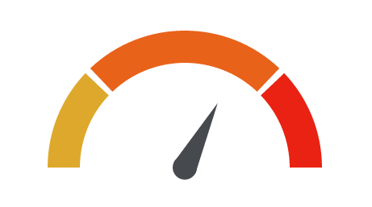

d3 guage bower package.

###Reference

[Jake Trent's CodePen](http://codepen.io/jaketrent/pen/eloGk)

###Usage

- Bower install.
```
bower install ng-d3-guage
```

- Set the directive anywhere you want.
```
d3-guage(guage-option="guageOption")
```

- Import module to your app module.
```
angular.module("demo", ["d3Guage"])
```

- Set the option in your controller.
```
$scope.guageOption =
  startPercent: .75
  barWidth: 40
  paddingRadius: .05
  pointer:
    percent: .65
    length: 90
    radius: 15
  sections: [
    {
      percent: .25
      className: "chart-color1"
    }
    {
      percent: .50
      className: "chart-color2"
    }
    {
      percent: .25
      className: "chart-color3"
    }
  ]
```

- Set the css.

- Done!

###Example:

